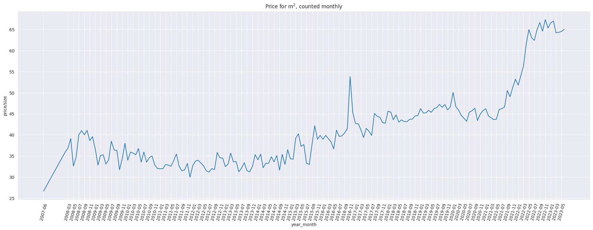
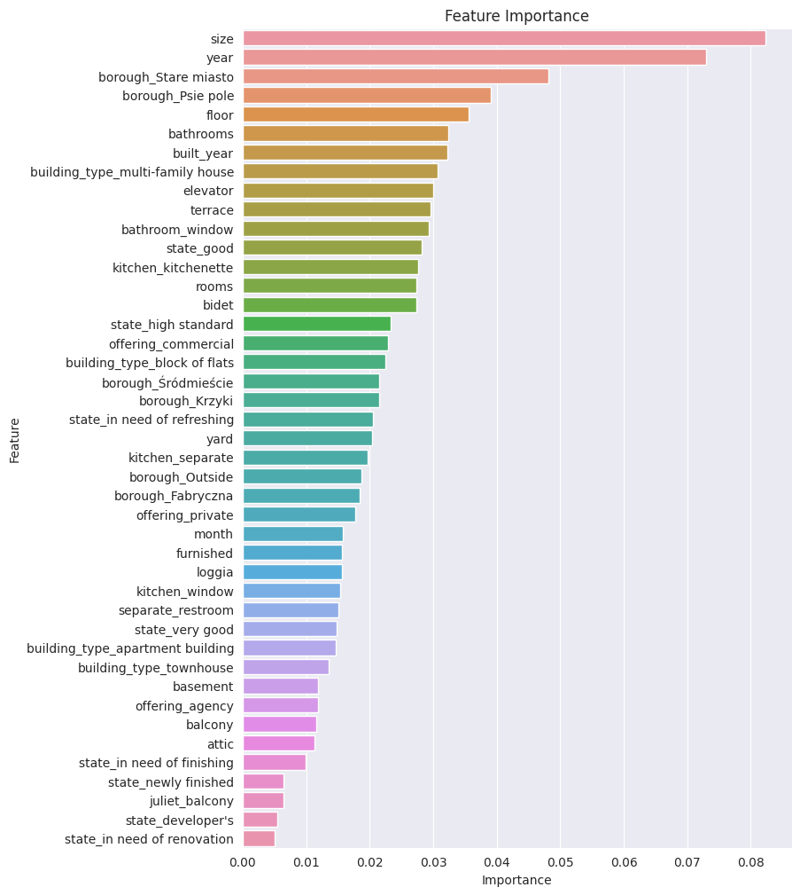

# Rental Price Analysis and Prediction Model

## Project Description

This project aims to develop a rental price analysis and prediction model for real estate properties.
The goal is to analyze historical rental data and build a machine learning model that can predict rental prices for new properties based on various features.

## Website

To play around with the model, please visit: [www.andkonar.pythonanywhere.com](https://andkonar.pythonanywhere.com)

## Libraries and Technologies Used

The following libraries and technologies are used in this project:

- BeautifulSoup
- pandas
- NumPy
- seaborn
- scikit-learn
- xgboost

## Project Overview
- **Data Collection**: Rental data was collected from nieruchomosci-online using web scraping techniques with BeautifulSoup.
- **Data Preprocessing**: The collected data is cleaned, missing values are handled, and necessary feature engineering is performed using pandas and NumPy.
- **Data Visualization**: We use seaborn to visualize the rental data and identify trends, patterns, and outliers.
- **Model Building**: A machine learning model for rental price prediction is constructed using scikit-learn pipelines with XGBRegressor.
- **Prediction**: The trained model is used to predict rental prices.

## Short Data Analysis and Prediction results

**Graph bellow shows price per sqr m for month between 2007 and 2023.**
Noticeable spikes in the data may be due to limited data availability during those months. The surge towards the end of 2016 can be attributed to a higher number of expensive rentals.
The dramatic increase starting in 2021 is clearly evident.

**Graph bellow shows price per sqr m for Boroughs.**
This is unexpected, city center rentals (old town - 'Stare miasto' borough) should be pricier, while those farther away should be cheaper.
Unusually high costs for rentals outside the city, but not in 2023.

**Graph bellow shows mean price for sqr m for when the building was built.**
Old building have what seems to be a random distribution of prices. It requires some normalization. 

**Graphs bellow show residual plot for the test data and feature importance.**

## What could be improved

Good data was surprisingly hard to get a hold off. A lot of the listings were very bare and uninformative, especially the older listings.
I had to greatly compromise between the availability of the data and its usage. What it got is a bit too little, in my opinion.
Finding better data or gathering more recent data for a much longer time is the way to go. 

## Building upon the project 

**Some ideas I had about usage and implementation of this project**

- Extending it to other cities or the entire country.

- Combining it with a real estate price prediction model to find interesting relations between the datasets. 
This could allow for better financial decisions regarding buying property for rentals.
